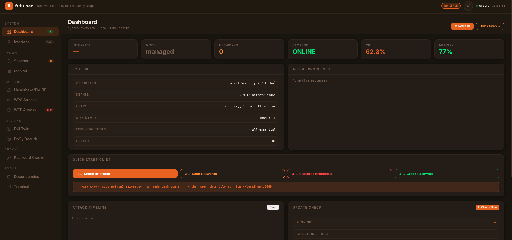
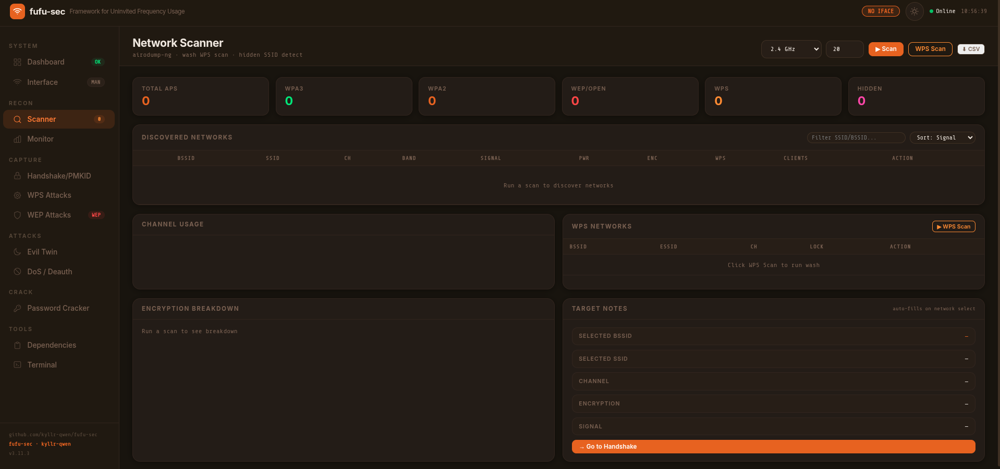
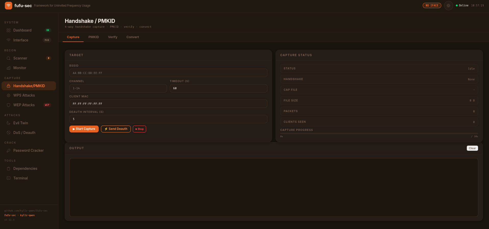
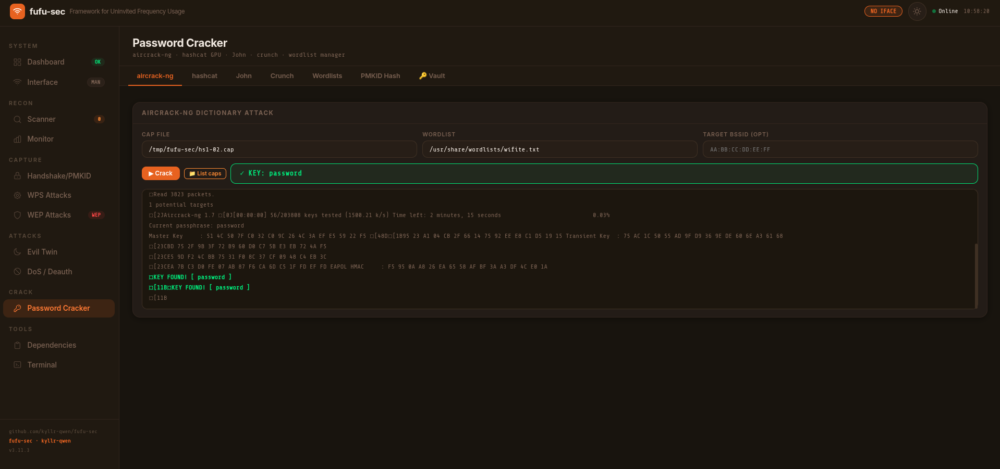
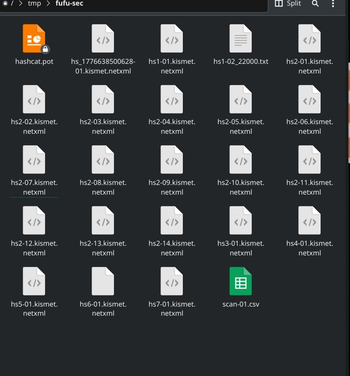
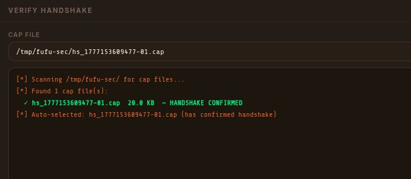

# fufu-sec

fufu-sec (Framework for Uninvited Frequency Usage) is a next-generation WiFi security framework for personal and enterprise wireless auditing. It covers the full attack surface of 802.11 networks from a single browser dashboard. network discovery, handshake capture, PMKID extraction, WPS exploitation, rogue access points, denial of service, WEP cracking, and GPU-accelerated password recovery, all in one place.

> Authorized use only. Test networks you own or have written permission to audit.


## Dashboard










## Features

| Module | What it does |
|---|---|
| **Interface** | Monitor mode, MAC spoofing, TX power control, injection testing, channel management |
| **Scanner** | Live network discovery with client counts, signal strength, encryption details, WPS scan |
| **Handshake Capture** | 4-way WPA2 handshake capture with multi-tier deauth (12s burst, 3s stabilize, repeat) |
| **PMKID Capture** | hcxdumptool PMKID extraction with BPF filtering, named capture files per network |
| **Password Cracker** | aircrack-ng dictionary attack, hashcat GPU mode 22000, John the Ripper, crunch wordlist generator |
| **WPS Attacks** | Reaver, Bully, Pixie Dust, known PIN database, NULL PIN |
| **Evil Twin** | Rogue AP with hostapd, DHCP/DNS via dnsmasq, captive portal, live credential harvesting |
| **DoS / Deauth** | aireplay-ng targeted deauth, mdk4 beacon flood, deauth amok, auth DoS, WIDS confusion, Michael TKIP |
| **WEP Attacks** | ARP replay, fake auth, fragmentation, chop-chop, Caffe Latte, Hirte, besside-ng auto-crack |
| **WiFi Monitor** | Live packet capture, client tracking, automatic handshake detection, multi-session cap files |
| **Terminal** | In-browser command terminal with full audit log |
| **Dependencies** | Live tool checker with install status for all required and optional packages |


## Requirements

- Linux (Kali or Parrot OS recommended)
- Python 3.8+
- Root access (`sudo`)
- WiFi adapter with monitor mode and packet injection support

Tested adapters: Alfa AWUS036ACH, AWUS036ACS, AWUS1900, TP-Link TL-WN722N v1.


## Install

```bash
git clone https://github.com/kyllr-qwen/fufu-sec.git
cd fufu-sec
sudo bash install.sh
```

The installer handles all dependencies inside the project folder. To remove fufu-sec, delete the folder.


## Start

```bash
cd fufu-sec
sudo .venv/bin/python3 server.py
```

Open the dashboard.html in your browser.

```bash
# Custom port or host
sudo .venv/bin/python3 server.py --port 8080
sudo .venv/bin/python3 server.py --host 0.0.0.0
```


## Workflows

### WPA2 handshake capture and crack

```
1. Interface  ->  Enable Monitor Mode
2. Interface  ->  Test Injection
3. Scanner    ->  Start Scan  ->  click Use on your target
4. Handshake  ->  Start Capture
              ->  Wait for HANDSHAKE CAPTURED
5. Cracker    ->  aircrack-ng tab  ->  Start
           or ->  hashcat tab  ->  Convert  ->  Crack (GPU)
```

### PMKID attack

```
1. Interface  ->  Enable Monitor Mode
2. Handshake  ->  PMKID tab  ->  BSSID + Channel  ->  Capture PMKID
3. Handshake  ->  PMKID tab  ->  Verify Capture
4. Cracker    ->  PMKID Hash tab  ->  Crack with hashcat
```

### WPS attack

```
1. Scanner    ->  WPS Scan  ->  find target with WPS enabled
2. WPS        ->  select attack (Reaver / Bully / Pixie Dust)
3. WPS        ->  Start Attack  ->  wait for PIN or PSK
```

### Evil Twin

```
1. Scanner    ->  scan and select target AP
2. Evil Twin  ->  configure SSID, channel, captive portal
3. Evil Twin  ->  Start Attack  ->  monitor credential log
```


## Capture files





All capture files land in `/tmp/fufu-sec/`. Each session gets a unique timestamp-based name so nothing is overwritten between runs. The WiFi Monitor and Handshake tabs both list all captured files with handshake status, size, and quick actions.


## Troubleshooting

| Symptom | Fix |
|---|---|
| `airodump-ng exited immediately` | `airmon-ng stop wlan0mon && airmon-ng start wlan0` |
| `No handshake captured` | AP may have PMF active. Try the PMKID tab instead |
| `hcxdumptool PACKET_STATISTICS failed` | `airmon-ng check kill` then retry |
| `Conversion failed: missing radiotap` | `sudo apt install wireshark-common` (provides editcap) |
| `hashcat: all hashes in potfile` | Password already cracked, check the key banner |
| `Password not in wordlist` | `hashcat -m 22000 -r /usr/share/hashcat/rules/best64.rule hash.txt rockyou.txt` |
| `hashcat: no OpenCL devices` | `sudo apt install ocl-icd-opencl-dev pocl-opencl-icd` |
| `rockyou.txt not found` | `sudo gunzip /usr/share/wordlists/rockyou.txt.gz` |


*by [kyllr-qwen](https://x.com/kyllr_qwen) · fufu-sec v3.11.3*
